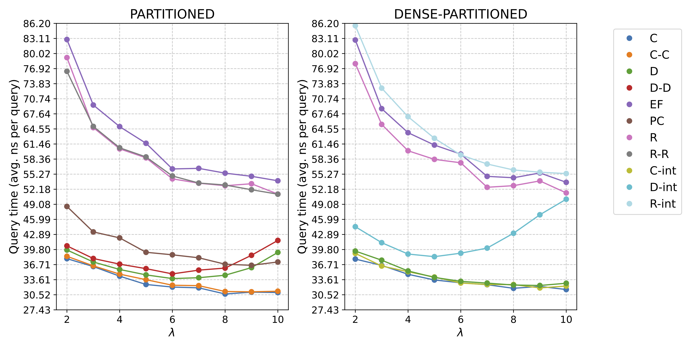

Benchmarks
----------

The following results were obtained on a machine equipped with an Intel Xeon W-2245 CPU @ 3.90GHz, and running Ubuntu 18.04.6. The code was compiled with `gcc` 10.3.0.
For building, we used **8 parallel threads**. Construction happened entirely in **internal memory**.

The results were obtained on 07/09/25 (see logs [here](results-07-09-25)), using (from within the `build` directory where the code was compiled):

    python3 ../script/run_benchmark.py -n 100000000

The following plots were obtained by running (from withing `script`):

    bash plot_all.sh ../benchmarks/results-07-09-25/results.2025-09-07T17-31-42.n=100000000

**Nomenclature** used in the plots and results:

- "PARTITIONED" is the HEM approach with an avg. partition size of `num_keys / (4 * num_threads)`, i.e., each thread builds 4 partitions. We refer to this approach as `P` henceforth.

- "DENSE-PARTITIONED" fixes the table size for each partition to 4096, so each partition has $\leq$ 4096 keys. We refer to this approach as `DP` henceforth.

### 1. Building time

##### Skew bucketer

##### Optimal bucketer

- `DP` and `P` with $\alpha=0.94$ have essentially the same building time (with `DP` being slightly faster).
- The use of optimal bucketing yields 2X faster construction for sufficiently large lambdas, e.g., $\lambda > 6$.

### 2. Space

The space plotted for `P` is for $\alpha=0.94$.

##### Skew bucketer

##### Optimal bucketer

- For `P`, the dual encoders `C-C`, `D-D`, `R-R` are not that effective compared to their non-dual versions, `C`, `D`, and `R`. This is due to partitioning; over non-partitioned representations they are very effective.
- For `DP`, the interleaved encoders (suffix "-int") are more effective than their non-interleaved versions, except for `R` (Rice codes).
- Optimal bucketing slightly but consistently improves space over skew bucketing.

### 3. Query time

Timings plotted for `P` are for $\alpha=0.94$.

##### Skew bucketer

##### Optimal bucketer

- Optimal bucketing does not generally introduce any penalty at query time compared to skew bucketing.

### 4. Overall trade-off and recommendation

Overall, the DENSE-PARTITIONED representation with the `C-int` encoder and optimal bucketing, using $\lambda = 7$, provides a well-rounded trade-off across the three performance metrics, with a stronger emphasis on query time than on space efficiency:

    ./build -n 100000000 -l 7 -b opt -e C-int -t 8 -q 10000000 -s 0 --minimal --dense --verbose

Result:

    {"n": "100000000", "lambda": "7.000000", "minimal": "true", "encoder_type": "C-int", "bucketer_type": "opt", "avg_partition_size": "3818", "num_partitions": "26192", "dense_partitioning": "true", "seed": "0", "num_threads": "8", "external_memory": "false", "partitioning_microseconds": "611533", "mapping_ordering_microseconds": "759244", "searching_microseconds": "6847463", "encoding_microseconds": "93348", "total_microseconds": "8311588", "pt_bits_per_key": "2.051930", "mapper_bits_per_key": "0.457273", "bits_per_key": "2.509203", "nanosec_per_key": "33.461714"}